# 在 booskit 文档中使用

如果您是 booskit 文档的贡献者，参考如下几个简单步骤即可完成 Doc Tools 的安装使用

1. [了解 booskit 文档要开启的检查项](#检查项)
2. [安装 Doc Tools 插件](#安装插件)
3. [找到 Doc Tools 相关配置](#打开配置)
4. [完成必要配置](#必要配置)

若您还想了解插件的其它功能，可参考进阶步骤：

1. [使用对应检查项的批量扫描功能](#批量扫描)
2. [了解其它可选配置](#可选配置)

## 目录

- [检查项](#检查项)
- [安装插件](#安装插件)
- [打开配置](#打开配置)
- [必要配置](#必要配置)
  - [一键文档配置](#一键文档配置)
- [可选配置](#可选配置)
  - [检查范围](#检查范围)
  - [配置 markdownlint 规则](#配置-markdownlint-规则)
  - [配置链接检查白名单](#配置链接检查白名单)
- [批量扫描](#批量扫描)
  - [markdownlint：批量执行 Markdown 语法检查](#markdownlint批量执行-markdown-语法检查)
  - [tag-closed-check：批量执行 Html 标签闭合检查](#tag-closed-check批量执行-html-标签闭合检查)
  - [link-validity-check：批量执行链接有效性检查](#link-validity-check批量执行链接有效性检查)
  - [resource-existence-check：批量执行资源有效性检查](#resource-existence-check批量执行资源有效性检查)

## 检查项

booskit 文档开启 markdownlint、tag-closed-check、link-validity-check、resource-existence-check 这四个检查项。

| 名称 | 功能 |
| ---- | ---- |
| markdownlint | Markdown 语法检查 |
| tag-closed-check | Html 标签闭合检查 |
| link-validity-check | 链接有效性检查（包含：1. 内链；2. 外链） |
| resource-existence-check | 资源有效性检查（包含：1. 内链；2. 外链） |

## 安装插件

1. 点击左侧插件菜单
2. 输入搜索 `Doc Tools`
3. 点击 `Install` 即可

<div style="box-shadow: 0 4px 8px rgba(0, 0, 0, 0.1); border-radius: 4px; display: inline-block; overflow: hidden; margin-bottom: 10px;">
  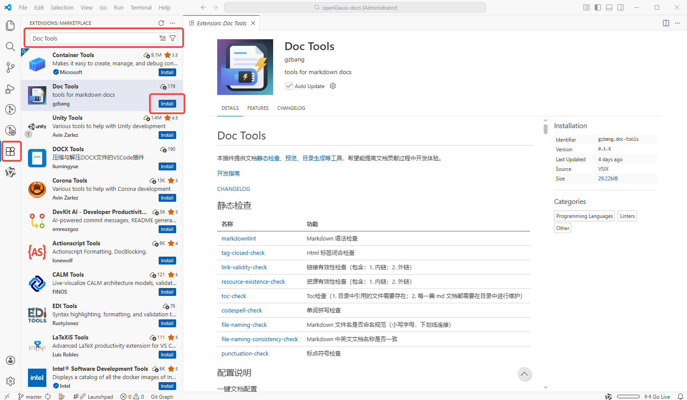
</div>

## 打开配置

点击  `File` -> `Preferences` -> `Settings`，搜索 `docTools` 或 `doc tools`，即可查看所有相关配置项。

中文页面版本：`文件` -> `首选项` -> `设置`

<div style="box-shadow: 0 4px 8px rgba(0, 0, 0, 0.1); border-radius: 4px; display: inline-block; overflow: hidden; margin-bottom: 10px;">
  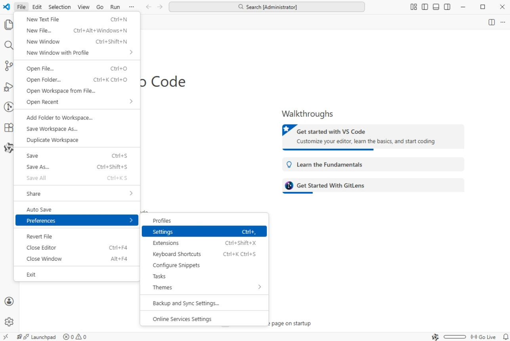
</div>

<div style="box-shadow: 0 4px 8px rgba(0, 0, 0, 0.1); border-radius: 4px; display: inline-block; overflow: hidden; margin-bottom: 10px;">
  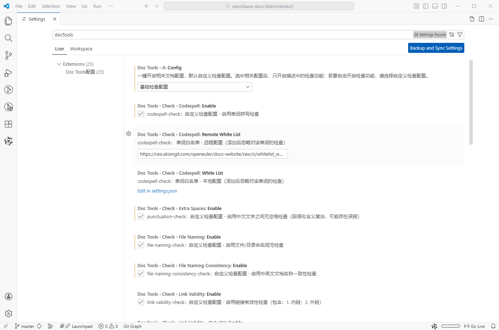
</div>

## 必要配置

请跟随必要配置完成配置即可~

### 一键文档配置

开启`基础检查配置`

**方法1. 通过右下角状态栏快速切换**

先打开任意一篇 markdown 文档，点击状态栏的 Doc Tools，选择 `基础检查配置`：

<div style="box-shadow: 0 4px 8px rgba(0, 0, 0, 0.1); border-radius: 4px; display: inline-block; overflow: hidden; margin-bottom: 10px;">
  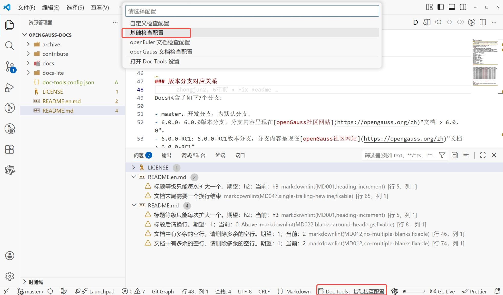
</div>

**方法2.通过设置页面进行设置**

<div style="box-shadow: 0 4px 8px rgba(0, 0, 0, 0.1); border-radius: 4px; display: inline-block; overflow: hidden; margin-bottom: 10px;">
  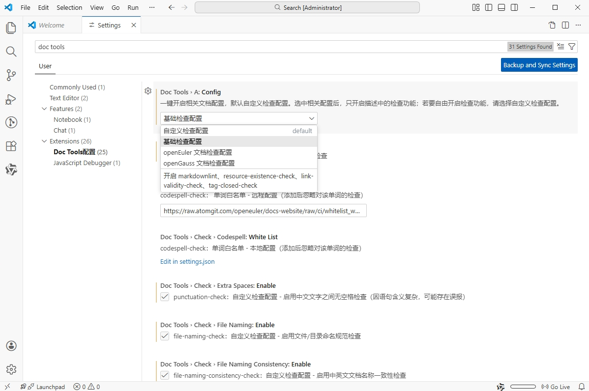
</div>

## 可选配置

以下内容为可选配置，如无必要，可跳过此步骤。

### 检查范围

> 此功能默认不开启！

如果想限制插件仅对路径包含特定目录名称的文件进行检查，可以按如下操作配置：

1. 设置中搜索 `docTools.scope`
2. 勾选启用`检查范围限制`
3. 输入路径正则表达式

<div style="box-shadow: 0 4px 8px rgba(0, 0, 0, 0.1); border-radius: 4px; display: inline-block; overflow: hidden; margin-bottom: 10px;">
  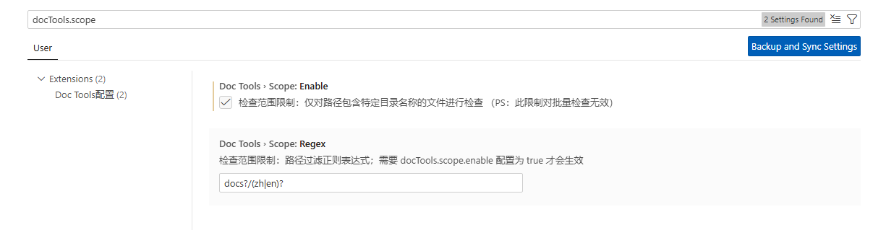
</div>

### 配置 markdownlint 规则

1. 设置中搜索 `docTools.markdownlint`；
2. 修改本地配置：点击`Edit in settings.json` 在弹出的 json 配置文件中按 json 格式编辑；
3. 修改远程配置：修改输入框内远程配置地址。

本地如何配置 markdownlint 请参考内容：[markdownlint-rules](https://atomgit.com/openeuler/docs/blob/stable-common/docs/zh/contribute/markdownlint_rules.md#%E9%85%8D%E7%BD%AE)

> 注意：当前默认拉取 openEuler 文档的 markdownlint 远程配置

<div style="box-shadow: 0 4px 8px rgba(0, 0, 0, 0.1); border-radius: 4px; display: inline-block; overflow: hidden; margin-bottom: 10px;">
  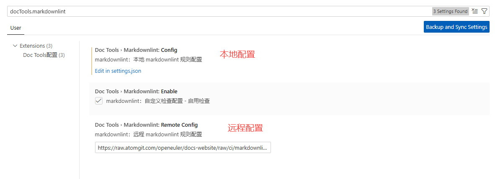
</div>

<div style="box-shadow: 0 4px 8px rgba(0, 0, 0, 0.1); border-radius: 4px; display: inline-block; overflow: hidden; margin-bottom: 10px;">
  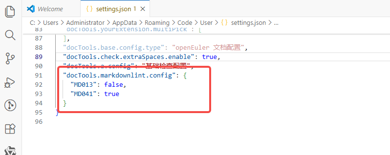
</div>

#### 配置说明

- `docTools.markdownlint.config`
  - 类型：`object`
  - 说明：本地 markdownlint 规则配置
  - 默认：`{}`

##### 配置示例

```json
{
  "docTools.markdownlint.config": { 
    "MD013": false,
    "MD041": true
  }
}
```

#### 规则说明

插件会拉取远程 markdownlint 规则配置，并使用本地规则配置覆盖远程规则配置进行 markdownlint 检查。

### 配置链接检查白名单

1. 设置中搜索 `docTools.check.url`；
2. 修改本地配置：点击`Edit in settings.json` 在弹出的 json 配置文件中按 json 格式编辑；
3. 修改远程配置：修改输入框内远程配置地址。

> 白名单地址支持正则表达式

<div style="box-shadow: 0 4px 8px rgba(0, 0, 0, 0.1); border-radius: 4px; display: inline-block; overflow: hidden; margin-bottom: 10px;">
  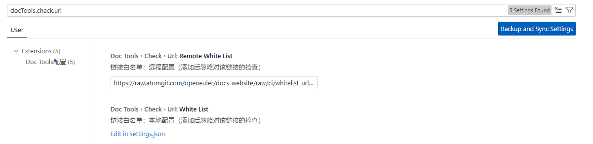
</div>

<div style="box-shadow: 0 4px 8px rgba(0, 0, 0, 0.1); border-radius: 4px; display: inline-block; overflow: hidden; margin-bottom: 10px;">
  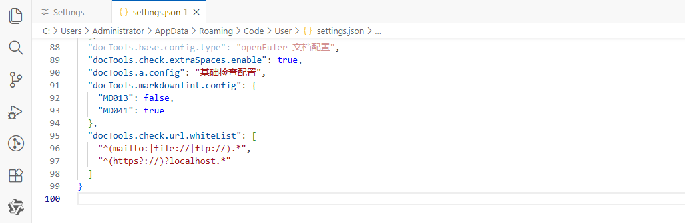
</div>

#### 配置说明

- `docTools.check.url.whiteList`
  - 类型：`array`
  - 说明：链接白名单：本地配置（添加后忽略对该链接的检查）
  - 默认：`[]`

##### 配置示例

```json
{
  "docTools.check.url.whiteList": [
    "^(mailto:|file://|ftp://).*",
    "^(https?://)?localhost.*"
  ]
}
```

#### 注意事项

- 默认开启`链接有效性检查只在链接无法访问时提示`配置，可自由关闭此配置；
- 插件仅检测链接的格式和可达性，不保证目标内容的正确性；
- 某些私有或受限网络下的链接可能因网络原因被误判为无效；
- 对于本地文件链接，需确保路径正确且文件存在。
- 远程白名单和本地白名单会进行合并，最终生效的白名单配置为合并后的结果。

## 批量扫描

| 名称 | 功能 |
| --- | --- |
| [markdownlint：批量执行 Markdown 语法检查](#markdownlint批量执行-markdown-语法检查) | 对选中目录下的所有 Markdown 文件执行 Markdownlint |
| [tag-closed-check：批量执行 Html 标签闭合检查](#tag-closed-check批量执行-html-标签闭合检查) | 批量检查选中目录下的 Markdown 是否有 Html 标签闭合错误 |
| [link-validity-check：批量执行链接有效性检查](#link-validity-check批量执行链接有效性检查) | 批量检查选中目录下所有 Markdown 涉及链接的可访问性 |
| [resource-existence-check：批量执行资源有效性检查](#resource-existence-check批量执行资源有效性检查) | 批量检查选中目录下所有 Markdown 涉及资源的可访问性 |

使用方法：`右击选中目录` - `Doc Tools` - `选中具体功能`，在打开的页面中完成扫描

<div style="box-shadow: 0 4px 8px rgba(0, 0, 0, 0.1); border-radius: 4px; display: inline-block; overflow: hidden; margin-bottom: 10px;">
  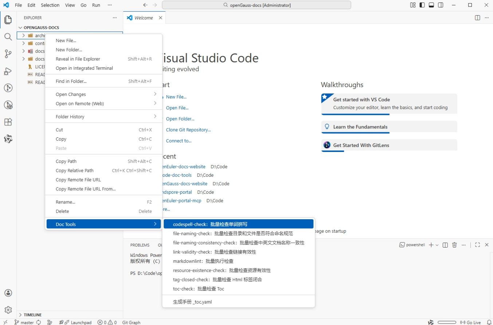
</div>

### markdownlint：批量执行 Markdown 语法检查

#### 功能介绍

- 对选中目录下的所有 Markdown 文件执行 Markdownlint；
- 通过页面的方式呈现检查结果，清晰展示错误信息；
- 提供一键修复功能。

#### 使用方法

1. 安装并启用本插件；
2. 在资源管理器中右键点击需要检查的目录；
3. 选择菜单`Doc Tools`，再选择`markdownlint：批量执行 Markdown 语法检查`选项；
4. 在打开的页面点击`开始检查`；
5. 执行完成后，可点击`一键修复`进行批量修复；
6. 导出结果可点击`导出数据`。

#### 注意事项

- 批量执行会递归遍历选中目录下的所有 Markdown 文件，可能需要一些处理时间；
- 并非所有 Markdownlint 错误都可以自动修复，如遇到无法修复的请按照提示手动修复。

### tag-closed-check：批量执行 Html 标签闭合检查

#### 功能介绍

- 支持批量检查选中目录下的 Markdown 文件中的 Html 标签闭合情况；
- 通过页面的方式呈现检查结果，清晰展示错误信息。

#### 使用方法

1. 安装并启用本插件；
2. 在资源管理器中右键点击需要检查的目录；
3. 选择菜单`Doc Tools`，再选择`tag-closed-check：批量执行 Html 标签闭合检查`选项；
4. 在打开的页面点击`开始检查`；
5. 导出结果可点击`导出数据`。

#### 注意事项

- 批量检查会递归遍历选中目录下的所有 Markdown 文件，可能需要一些处理时间。

### link-validity-check：批量执行链接有效性检查

#### 功能介绍

- 检查选中目录下所有 Markdown 涉及链接是否可以正常访问；
- 通过页面的方式呈现检测结果。

#### 使用方法

1. 安装并启用本插件；
2. 右键点击对应目录，选择菜单`Doc Tools`，再选择`link-validity-check：批量执行链接有效性检查`选项；
3. 在打开的页面勾选配置，点击`开始检查`；
4. 导出结果可点击`导出数据`。

#### 注意事项

- 某些私有或受限网络下的链接可能因网络原因被误判为无效，请以实际访问为准；

### resource-existence-check：批量执行资源有效性检查

#### 功能介绍

- 检查选中目录下所有 Markdown 涉及资源是否可以正常访问；
- 通过页面的方式呈现检测结果。

#### 使用方法

1. 安装并启用本插件；
2. 右键点击对应目录，选择菜单`Doc Tools`，再选择`resource-existence-check：批量执行资源有效性检查`选项；
3. 在打开的页面勾选配置，点击`开始检查`；
4. 导出结果可点击`导出数据`。

#### 注意事项

- 某些私有或受限网络下的链接可能因网络原因被误判为无效，请以实际访问为准；
