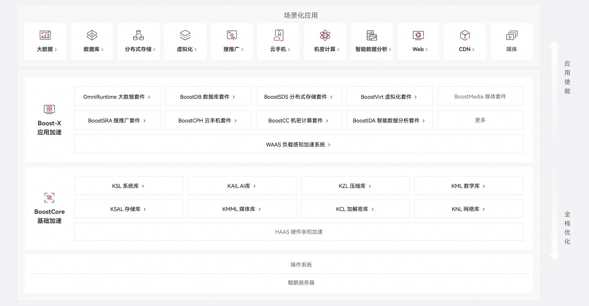

# BoostKit 应用使能套件简介

鲲鹏BoostKit提供丰富的基础加速库和应用加速套件；通过软硬协同，算法加速，实现十大主流场景性能倍增；全面走向开源，让鲲鹏创新技术触手可及。BoostKit整体架构分为场景化应用、Boost-X应用加速、Boost-Core基础加速三个层级。

**图1 BoostKit应用使能套件架构图**

**Boost-X应用加速**：面向主流应用场景，提供场景化应用层的加速软件包，包含应用创新加速组件、软硬协同加速组件、算法创新组件，例如：OmniRuntime 大数据套件的OmniOperator等软件包、BoostDB数据库套件的redis软件包、BoostCPH云手机套件中的KBOX等。

**BoostCore基础加速**：面向主流应用场景，提供OS及系统软件等基础软件层的加速软件包，例如：KSL系统库的hyperscan、KAE硬件加速引擎。

# BoostKit项目

## Boost-X应用加速项目

| 分类        | 描述       |
|-----------|----------|
| [OmniRuntime大数据套件](https://gitcode.com/boostkit/omniruntime/blob/master/README.md) | 鲲鹏BoostKit大数据套件OmniRuntime特性包含OmniOperator算子加速、OmniShuffle Shuffle加速、OmniAdvisor参数调优、OmniMV物化视图、OmniScheduler Yarn负载调度算法、OmniShield机密大数据、OmniHBaseGSI全局二级索引、OmniData算子下推、OmniStream Flink Native化以及OmniStateStore状态优化十大子特性，对数据获取、计算、交换、处理、缓存等阶段多维度优化，插件化解耦交付，提升不同场景大数据引擎性能。 |
| [BoostDB数据库套件](https://gitcode.com/boostkit/boostdb) | 鲲鹏BoostKit数据库套件BoostDB旨在基于鲲鹏提供数据库加速能力，聚焦应用加速、基础加速、系统加速全栈优化提升鲲鹏数据库性能，提供极致的数据库解决方案。 |
| [BoostSDS分布式存储套件](https://gitcode.com/boostkit/boostsds) | 鲲鹏BoostKit分布式存储套件BoostSDS旨在基于鲲鹏提供存储引擎的基础加速特性和应用加速特性，聚焦降低存储业务端到端时延，提升系统整体IOPS，打造业界高性价比的分布式存储底座，成为数据中心海量数据的基石。 |
| [BoostVirt虚拟化套件](https://gitcode.com/boostkit/boostvirt) | 鲲鹏BoostKit虚拟化套件BoostVirt旨在基于鲲鹏提供虚拟化和云原生的应用加速能力，聚焦提升鲲鹏虚拟化计算性能、降低网络存储的IO损耗、提升业务在虚拟机和容器中的性能，提供虚拟化开源使能优化。 |
| [BoostSRA搜推广套件](https://gitcode.com/boostkit/boostsra) | 鲲鹏BoostKit搜推广使能套件旨在为互联网搜索、推荐、广告业务场景提供基于鲲鹏平台的应用层加速能力，组件涵盖召回场景核心检索算法、排序场景模型推理软件框架优化。 |
| [BoostCPH云手机套件](https://gitcode.com/boostkit/boostbox) | 鲲鹏BoostKit云手机场景利用ARM指令集同构优势，支持移动应用无损上云，同时将多年技术积累浓缩到Kbox云手机容器、指令流引擎、视频流引擎核心能力等组件，形成了云手机Turbo套件，帮助客户和伙伴实现云手机极致的性能和业务体验。 |
| [WAAS负载感知加速系统](https://gitcode.com/boostkit/waas) | 负载感知加速系统，通过负载识别和性能建模，基于每个计算任务深度调优，自动配置全栈最佳参数，完成量体裁衣似的动态资源分配，做到资源配给与资源需求实时最佳。 |
| [BoostMedia媒体套件](https://gitcode.com/boostkit/boostmedia) | 鲲鹏BoostKit媒体套件旨在为视频编解码、图像处理场景提供基于鲲鹏平台的应用层加速能力。 |
| [BoostIDA智能数据分析套件](https://gitcode.com/boostkit/boostida) | 鲲鹏智能数据分析套件BoostIDA提供鲲鹏亲和的高性能数据分析能力，具体应用包括加密流量监测，正则表达式高性能匹配等。 |
| [BoostCC机密计算套件](https://www.hikunpeng.com/document/detail/zh/kunpengcctrustzone/overview/kunpengcctrustzone.html) | 鲲鹏BoostKit机密计算套件BoostCC基于内生国密、机密计算等自主可控根技术，面向互联网、金融、运营商、安平等业务场景，提供端到端安全解决方案及行业最佳实践。 |

## [BoostCore基础加速项目](https://gitcode.com/boostkit/boostcore)

| 分类 | 描述 |
|------|------|
| KSL 系统库 | 鲲鹏系统库KSL（Kunpeng System Library）是华为提供的基于鲲鹏平台优化的高性能系统库，主要利用鲲鹏向量化指令集进行优化释放硬件算力。包括kpglibc（鲲鹏 GNU C Library），鲲鹏Hyperscan库，鲲鹏Json库等。 |
| KZL 压缩库 | 鲲鹏压缩库KZL（Kunpeng Zip Library）是华为提供的基于鲲鹏平台优化的高性能压缩库，利用鲲鹏指令优化和鲲鹏加速引擎KAE提升压缩性能和效率。包括zlib，zstd，Snappy，LZ4等常用的压缩软件。 |
| KAIL AI库 | 鲲鹏BoostKit AI算子库KAIL，基于鲲鹏微架构特性，对常用深度神经网络算子做深度优化，加速CPU侧推理性能。 |
| KML 数学库 | 鲲鹏数学库（Kunpeng Math Library，以下简称KML）提供了基于鲲鹏平台优化的高性能数学函数，所有接口由C/C++、汇编语言实现，部分接口兼容Fortran语言调用，部分提供Java语言封装的接口。 |
| KSAL 存储库 | 鲲鹏BoostKit存储库KSAL是基于常用存储算法在鲲鹏CPU进行深度优化，同时结合鲲鹏独有KAE硬算能力，为上层应用提供更高性能、更低延迟的存储库。 |
| KMML 媒体库 | 鲲鹏BoostKit媒体库KMML基于常用的媒体算法在鲲鹏CPU上进行深度优化，结合ARM特有的NEON、SVE指令集，为上层媒体应用提供高性能、高吞吐的媒体库。 |
| KCL 加解密库 | 鲲鹏加解密库KCL（Kunpeng Cryptography Library）是华为提供的基于鲲鹏平台优化的高性能加解密库，利用鲲鹏指令优化提升加解密性能和效率，支持商用密码算法。包括KACC_Crypto等。 |
| KNL 网络库 | 鲲鹏BoostKit网络库KNL是基于鲲鹏CPU优化的网络加速库，能够提供鲲鹏亲和的高性能网络能力。 |
| KAE 硬件加速库 | KAE（Kunpeng Accelerator Engine，鲲鹏加速引擎）是基于鲲鹏处理器提供的硬件加速解决方案，包含了KAE加解密和KAE解压缩。 |

# 关于社区

## 社区治理架构及章程

BoostKit社区采用SIGs轻量化运作模式，当前架构主要包括以下组织：

- [特别兴趣小组（SIG-Special Interest Group）](https://gitcode.com/boostkit/community/tree/master/sig)

## 参与贡献

欢迎大家为社区做贡献，如果使用过程中有任何问题/建议，或者需要反馈特性需求和bug报告，可以提交[Issues](zh-cn_topic_0000002535534673.md)联系我们，具体贡献方法可参考[这里](https://gitcode.com/boostkit/community/blob/master/docs/contributor/contributing.md)。同时也欢迎大家在[讨论专区](https://gitcode.com/boostkit/community/discussions)展开讨论交流。感谢您的支持

# 快速体验

| 快速入门 | 描述 |
|----------|---------|
| [KAE鲲鹏加速引擎 快速入门](https://gitcode.com/boostkit/KAE/blob/kae2/docs/zh/quick_start.md) | 本文档提供了BoostCore基础加速的鲲鹏加速引擎（KAE）加解密模块、压缩模块的简单安装和使用示例，旨在帮助用户快速正确的使用KAE。 |

# 实践样例

| 热门实践 | 描述 |
|----------|---------|
| [KAE鲲鹏加速引擎 最佳实践](https://gitcode.com/boostkit/KAE/blob/kae2/docs/zh/best_practices.md) | 本文档提供了BoostCore基础加速的鲲鹏加速引擎（KAE）的最佳实践示例。 |

# 社区活动

- [社区会议日历](https://meeting.boostkit.osinfra.cn/)：如果您对BoostKit社区的各类会议感兴趣，可访问会议日历。

# 相关链接

- [鲲鹏社区](https://www.hikunpeng.com/zh)
- [openEuler社区](https://www.openeuler.openatom.cn/zh)