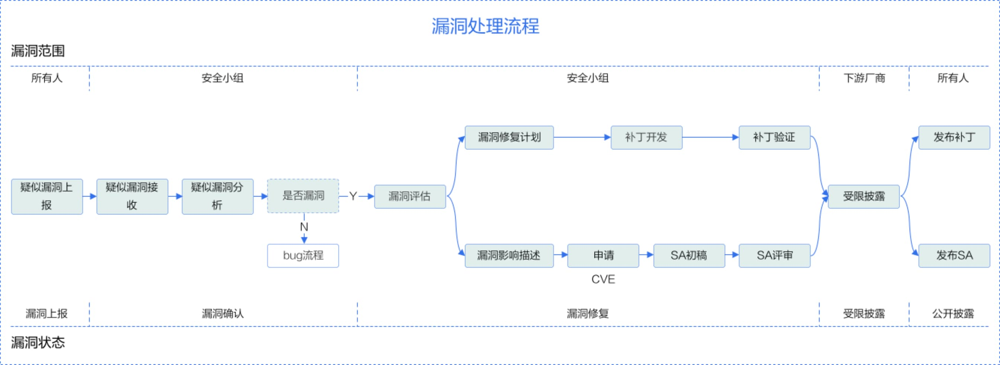

# 漏洞管理

## 1. 漏洞响应
BoostKit 社区非常重视社区版本的安全性，BoostKit  社区安全小组（SIG Security）负责接收、调查和披露 BoostKit 社区相关的安全漏洞。我们鼓励漏洞研究人员和行业组织主动将 BoostKit 社区的疑似安全漏洞报告给 BoostKit 社区安全小组。我们会快速的响应、分析和解决上报的安全问题或安全漏洞。

## 2. 支持版本
漏洞响应流程主要支持 BoostKit 社区的发行版。

## 3. 漏洞处理流程
每一个安全漏洞都会有一个指定的人员进行跟踪和处理，协调员是 BoostKit 安全小组的成员，他将负责跟踪和推动漏洞的修复和披露。漏洞端到端的处理流程如下图。

在这里我们主要介绍流程中漏洞上报、漏洞评估和漏洞披露这三部分内容。

### 3.1 漏洞上报
如果您认为 BoostKit 产品存在一个疑似安全漏洞，我们希望您将漏洞上报给 BoostKit 社区，并与我们配合以负责任的方式修复和披露该问题。

#### 3.1.1 漏洞上报方式
您可以通过 email 将 BoostKit 产品的潜在安全漏洞发送到 BoostKit 安全小组邮箱（[BoostKit@huawei.com](mailto:BoostKit@huawei.com)）。因为漏洞信息比较敏感，为确保机密性，建议您使用安全团队PGP公钥对邮件信息进行加密。我们能够收到使用 OpenPGP 加密的电子邮件。安全小组成员信息请参考: [成员信息](../../../README.md#成员)

#### 3.1.2 漏洞上报内容
为了便于快速的确认和验证疑似漏洞，请在漏洞上报邮件中包含但不限于以下内容：
- 基本信息：包括漏洞影响的模块、漏洞的触发条件和成功利用后对系统的影响等。
- 技术细节：包括系统配置、定位方法、Exploit 的描述、POC、问题重现方法和步骤等。
- 修复方案建议。
- 上报者的组织和联系方式。
- 上报者可能的漏洞披露计划。

#### 3.1.3 邮件响应时间
我们将在 5 天内响应通过邮箱上报的疑似安全漏洞，并向上报者反馈漏洞处理的进展。

### 3.2 漏洞严重性评估
业界普遍使用 CVSS 标准评估漏洞的严重性，BoostKit 在使用 CVSSv3 进行漏洞评估时，需要设定漏洞攻击场景，基于在该攻击场景下的实际影响进行评估。漏洞严重等级评估是指针对漏洞利用难易程度，以及利用后对机密性、完整性、可用性的影响进行评估，并生成一个评分值。

#### 3.2.1 评估标准
BoostKit 社区采用 CVSS v3 对漏洞进行评估，CVSS V3 通过以下向量评估漏洞影响：
- 攻击向量（AV）-表示攻击的“远程性”以及如何利用此漏洞。
- 攻击复杂性（AC）-讲述攻击执行的难度以及成功进行攻击需要哪些因素。
- 用户交互（UI）-确定攻击是否需要用户参与。
- 所需的权限（PR）-记录成功进行攻击所需的用户身份验证级别。
- 范围（S）-确定攻击者是否可以影响具有不同权限级别的组件。
- 机密性（C）-衡量信息泄露给非授权方后导致的影响程度。
- 完整性（I）-衡量信息被篡改后导致的影响程度。
- 可用性（A）-衡量用户在需要访问数据或服务时受影响的程度。

#### 3.2.2 评估原则
1. 评估漏洞的严重等级，不是评估风险。
2. 评估时必须基于攻击场景，且保证在该场景下，攻击者成功攻击后能对系统造成机密性、完整性、可用性影响。
3. 当安全漏洞有多个攻击场景时，应以造成最大影响、CVSS 评分最高的攻击场景为依据。
4. 被嵌入调用的库存在漏洞，要根据该库在产品中的使用方式，确定漏洞的攻击场景后进行评估。
5. 安全缺陷不能被触发或不影响 CIA（机密性/完整性/可用性），CVSS 评分为 0 分。

#### 3.2.3 评估步骤
对漏洞进行评估时，可根据下述步骤进行操作：
1. 设定可能的攻击场景，基于攻击场景评分。
2. 确定漏洞组件（Vulnerable Component）和受影响组件（Impact Component）。
3. 选择基础评估指标的值：通过对可利用指标（攻击向量/攻击复杂度/所需权限/用户交互/范围）和受影响指标（机密性/完整性/可用性）给出漏洞影响评估。

#### 3.2.4 严重等级划分
| 严重等级（Severity Rating） | CVSS评分（Score） |
| ---- | ---- |
| 致命（Critical） | 9.0 - 10.0 |
| 高（High） | 7.0 - 8.9 |
| 中（Medium） | 4.0 - 6.9 |
| 低（Low） | 0.1 - 3.9 |
| 无（None） | 0.0 |

### 3.3 漏洞披露
为了保护 BoostKit 用户的安全，在进行调查、修复和发布安全公告之前，BoostKit 社区会严格控制漏洞信息的范围，将之限制在仅处理漏洞的相关人员之间传递，不会公开披露、讨论或确认 BoostKit 产品的安全问题，同时也要求漏洞上报者对此漏洞进行保密，直到对外公开披露。

安全漏洞修复后 BoostKit 社区会发布安全公告，安全公告内容包括该漏洞的技术细节、CVE 编号、CVSS 安全评分、严重性等级以及受到该漏洞影响的版本和修复版本等信息。<!--安全公告提供邮件订阅功能，可通过 security 相关链接订阅 BoostKit 社区的安全公告。-->

---
## 页面目录索引
1. [漏洞响应](#1-漏洞响应)
2. [支持版本](#2-支持版本)
3. [漏洞处理流程](#3-漏洞处理流程)
    - [3.1 漏洞上报](#31-漏洞上报)
        - [3.1.1 漏洞上报方式](#311-漏洞上报方式)
        - [3.1.2 漏洞上报内容](#312-漏洞上报内容)
        - [3.1.3 邮件响应时间](#313-邮件响应时间)
    - [3.2 漏洞严重性评估](#32-漏洞严重性评估)
        - [3.2.1 评估标准](#321-评估标准)
        - [3.2.2 评估原则](#322-评估原则)
        - [3.2.3 评估步骤](#323-评估步骤)
        - [3.2.4 严重等级划分](#324-严重等级划分)
    - [3.3 漏洞披露](#33-漏洞披露)